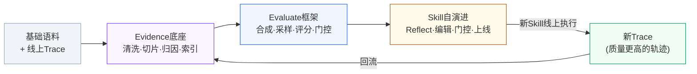

# Eval 驱动 Skill 自演进 — 核心概念问答

> 整理自四个关键问题：Evidence 的意义、Evaluate 框架的意义、Eval 驱动自演进的意义、数据飞轮闭环

---

## Q1：生成的 Evidence 本身的意义是什么？

### 本质意义

**一句话**：Evidence 是把"海量原始语料"提纯成的**可信、可复用、可检索的结构化事实单元**——它回答的不是"发生了什么"（那是日志），而是"**什么情况下、什么做法、导致什么结果、证据在哪**"。

没有 Evidence 层，下游只能直接在泥沙般的原始日志上做评测和演进，每次都要重新淘金；有了 Evidence 层，成败因果被固化为资产，评测集合成和 Skill 演进都从"挖矿"变成"取料"。

### 完整例子

**原始语料（泥沙）**：线上日志里有一条 40 轮的对话，用户要"按月汇总销售额"，Agent 中途反复出错最后失败了。这条日志 2 万 Token，混杂着寒暄、重试、无关工具输出——它本身什么都说明不了，也没法直接用。

**提纯后的一条 Evidence（金子）**：

```json
{
  "id": "EV-20260808-0147",
  "场景": "表格处理/时间维度聚合",
  "断言": "对日期列做groupby聚合前，必须先验证列类型并转换，否则按字符串排序导致月份错乱",
  "证据来源": {
    "失败轨迹": "traj_8821 第13轮：未检查类型直接groupby → 结果'10月'排在'2月'前 → 任务失败",
    "成功轨迹": "traj_9033 第13轮：先df.dtypes发现object类型 → pd.to_datetime转换 → 任务成功"
  },
  "支持强度": "同模式出现23次，成功/失败对比一致",
  "难度画像": "当前Skill在该模式下成功率58%",
  "时效": "2026-08，pandas 2.x 下验证有效"
}
```

### 这条 Evidence 的三重价值

1. **对 Evaluate 框架 —— 评测集的"种子与判分依据"**
   - 合成引擎读取它，变换出 500 道"日期类型陷阱"任务（换领域、换表结构、换日期格式）
   - Judge 判分时它就是标准答案依据："执行中是否包含类型检查步骤"成为可验证的评分点——不再依赖 Judge 的主观感觉

2. **对 Skill 演进 —— 补丁的"因果依据"**
   - 优化器不是凭空猜"该加什么规则"，而是直接把断言转化为补丁：`[add] 日期列聚合前先验证类型并转换`
   - 补丁被门控质疑时，可回溯到 23 次成败对比作为支持证据——每条 Skill 规则都有出处，可审计可追责

3. **对生命周期管理 —— 规则的"保鲜标签"**
   - 半年后 pandas 升级自动做类型推断，这条 Evidence 的时效性校验失败 → 触发对应 Skill 规则的复审下线——规则过期能被发现，而不是永远躺在 Skill 里占 Token

### 对比理解

| | 没有 Evidence 层 | 有 Evidence 层 |
|---|---|---|
| 合成评测任务 | 从 2 万 Token 原始日志现场分析 | 直接检索结构化断言当种子 |
| Skill 加规则 | LLM 看失败样本"拍脑袋"归纳，易引入伪因果 | 每条规则背后有 N 次成败对比支撑 |
| 规则被质疑 | 说不清当初为什么加 | 秒级回溯证据链 |
| 知识过期 | 无感知，垃圾规则持续占上下文 | 时效校验触发复审 |

**类比**：原始轨迹是"案发现场"，Evidence 是"经过质证的证据链"——法庭（评测门控）只认证据链，不认现场的一堆杂物。Evidence 底座就是把每个现场都提前整理成证据链的系统。

---

## Q2：Evaluate 框架本身的意义是什么？

### 本质意义

**一句话**：Evaluate 框架是把 Evidence（静态的事实资产）转化为**可规模化、可信赖的"能力度量仪"**——它回答的不是"我们知道什么"（那是 Evidence），而是"**当前 Skill 到底行不行、哪里不行、改了之后是真变好还是假变好**"。

没有 Evaluate 框架，Skill 演进就是"盲改"——加了规则不知道是否有效，看似提升可能只是背题；有了它，每次改动都有客观、可复现的裁判，**演进才从"感觉驱动"变成"度量驱动"**。它是整条链路的"法庭"：Evidence 提供证据，Evaluate 负责审判。

### 完整例子：Skill 从 v3 演进到 v4，要不要接受？

优化器基于失败案例给"表格处理 Skill v3"加了 2 条规则，产出候选 v4。**没有 Evaluate 框架时**，只能人工抽几个例子看看"好像变好了"就上线——结果线上老功能回退、Token 暴涨，两周后才被用户投诉发现。

**有 Evaluate 框架时**，v4 要过四道关：

**第1关：任务合成扩增 —— 有足够的考题**

Evidence 里只有 12 条"日期类型陷阱"真实案例，不够考。合成引擎以其为种子扩增出 500 道任务（换领域：销售→考勤；换格式：`2026/8/1`→`Aug-1`→时间戳；加干扰：混入缺失值）。长尾能力点也有了统计意义上够用的考卷。

**第2关：难度分层动态采样 —— 考得又准又省**

500 道题不全考。按 v3 历史通过率分层：简单题（通过率>90%）抽 20% 做回归即可，中等题（50-90%，"时对时错"最能暴露缺陷）抽 60% 重点考，困难题抽 20%。评测预算省一半，缺陷暴露率反而更高。

**第3关：多维校准评分 —— 分数可信**

v4 执行每道题产出多维分：

```
任务#217: 正确性 0.9 | Token 1.2万(超基线20%, 扣分) | 时延 45s(达标)
综合分 = 0.6×正确 + 0.25×Token + 0.15×时延 = 78
```

Judge 校准：抽样与人工对比发现 Judge 对"答案对但格式乱"普遍高估 10 分 → 加偏移修正；同题重评分差>15 的送强模型仲裁。保证"提升5分"是真提升，不是 Judge 抖动。

**第4关：留出集门控 —— 防背题**

考卷按**种子来源**切分：种子 1-8 衍生的 400 题给优化器训练用，种子 9-12 衍生的 100 题锁进留出集（优化器从未见过其祖先）。结果：

```
v4 训练集: 82 → 88 ✓
v4 留出集: 72 → 65 ✗   ← 过拟合！新规则是在"背训练题"
判决: 拒绝 v4, 回滚 v3, 失败补丁入缓冲区
```

一次本会造成线上事故的伪提升，在上线前被拦截。

### 对比理解

| | 没有 Evaluate 框架 | 有 Evaluate 框架 |
|---|---|---|
| 改动是否有效 | 人工抽查"感觉变好了" | 500 题统计显著性验证 |
| 过拟合/背题 | 上线后靠用户投诉发现 | 留出集门控上线前拦截 |
| Token/时延恶化 | 无感知，只看对错 | 多维评分共同约束 |
| 评测成本 | 全量跑或凭经验挑 | 分层采样，省一半预算 |
| 能否复现 | 每次人工评，结论漂移 | 同一 benchmark 可重跑对比 |

**类比**：Evidence 底座是"题库素材+标准答案依据"，Evaluate 框架是**完整的考试院**——负责出卷（合成）、组卷（采样）、阅卷（校准评分）、防作弊（留出集门控）。Skill 每次演进都必须来考试院拿到成绩单，**成绩单就是驱动自演进的"梯度信号"**：哪个能力点丢分，下一轮就往哪里优化。

---

## Q3：Eval 驱动自演进本身的意义是什么？

### 本质意义

**一句话**：Eval 驱动自演进是把 Skill 的优化从"**等线上出问题→人工修**"变成"**离线批量考试→自动改**"——它回答的不是"Skill 现在怎么样"（那是 Evaluate），而是"**如何让 Skill 不依赖人力、不依赖线上流量，自己持续变强**"。

三层意义：

1. **摆脱人力瓶颈**：Prompt/Skill 工程师手工调优一个场景要数天，且水平因人而异；自演进把"发现问题→归因→改写→验证"全流程自动化，一夜可跑几十轮迭代
2. **摆脱线上流量依赖**：不必等真实用户踩坑才获得改进信号——用合成 benchmark 离线"预演"千百次失败，问题在上线前就被修掉
3. **保证方向正确**：每次改动都被 Eval 门控裁决，只保留验证有增益的版本——**进化有方向、不退化、可复现**，而不是随机漂移

### 完整例子：新上线的"发票识别整理" Skill

**传统人工模式（对照组）**

v0 Skill 上线，成功率 55%。接下来两个月：

- 第1周：用户投诉"增值税专票金额提错" → 工程师看日志、复现、改 Prompt → 发 v1
- 第3周：又投诉"多张发票合并PDF识别串行" → 再人工修 → 发 v2，**但 v2 把第1周修好的专票问题改回退了**，没人发现
- 第6周：回退被投诉，再修……

两个月修 3 个问题，成功率 55%→70%，消耗一名工程师大量时间，改进速度 = 用户踩坑速度 × 人力响应速度。

**Eval 驱动自演进模式**

同样的 v0，接入自演进流水线，当晚自动执行：

```
第1轮: Rollout 300道合成发票任务 → 55分
       失败聚类: ①专票/普票字段位置混淆(38%) ②合并PDF串行(24%) ③手写发票(18%)
       Reflect产出补丁 → 门控通过 → v1: 67分
第2轮: 针对剩余失败继续 → v2: 74分
       (门控发现v2候选让专票回退 → 自动拒绝该补丁, 换下一候选)
第3-8轮: ...每轮聚焦当前最大失败簇...
第9轮: 留出集增益<1分, 触发收敛停止 → 产出 best_skill v8: 86分
```

一夜完成人工两个月的工作，且：

- 第2轮那次"专票回退"被门控自动拦截——人工模式下这就是第3周的线上事故
- 手写发票这类**用户还没大量踩到的坑**，因为合成任务提前覆盖，上线前已修复
- 全程产出 9 个版本快照+每轮成绩单，任何一条规则都可追溯"为什么加、提了几分"

### 对比理解

| | 人工模式 | Eval驱动自演进 |
|---|---|---|
| 改进信号来源 | 用户投诉（滞后、抽样偏差） | 离线合成千级任务（前置、全覆盖） |
| 迭代速度 | 周级，受人力排期 | 小时级，可通宵自动跑 |
| 回退风险 | 靠工程师记忆，常翻车 | 门控自动拦截，单调不退化 |
| 长尾场景 | 流量太少，永远排不上优先级 | 合成扩增补足，长尾也能进化 |
| 改动可解释性 | 散落在聊天记录和个人经验里 | 每条规则有Evidence和评分记录背书 |

**PPT 一句话**：Eval驱动自演进以离线批量评测替代线上踩坑、以自动"归因-编辑-门控"替代人工调优，让Skill在无人干预下按天完成人工按月的能力迭代——进化不靠等流量、不靠堆人力，且每一步有据可查、只升不退。

---

## Q4：新 Skill 产生新 Trace，会形成循环吗？

**答案：完全正确，这就是整个体系最关键的设计——数据飞轮闭环。**

### 闭环流程



### 每转一圈，四个东西都在变好

1. **Trace 质量升级**：新 Skill 成功率更高 → 新 Trace 中成功轨迹占比上升，且失败案例是"更难的失败"（简单错误已被消灭）→ 下一轮 Evidence 提炼的是更高阶的因果知识

2. **Evidence 持续增殖与保鲜**：
   - 新增：新场景、新失败模式进入底座
   - 验证：旧 Evidence 被新 Trace 反复确认，支持强度上升
   - 淘汰：新 Skill 下不再复现的旧问题，对应 Evidence 时效降权 → 底座不是只增不减，而是新陈代谢

3. **Benchmark 难度自适应爬升**：旧题被 Skill "打穿"（通过率>95%）后降为回归题，新 Evidence 合成更难的新题 → 评测集跟着 Skill 能力水涨船高，永远考在"最近发展区"

4. **Skill 逼近该场景的能力上限**：每轮只学"当前最有信息量的失败" → 演进方向始终对准短板

### 必须防的风险：自污染

循环也可能**放大错误**：如果某轮演进引入了有害规则且门控没拦住 → 新 Trace 带着系统性偏差 → 提炼出被污染的 Evidence → 合成有偏的 Benchmark → 下一轮"验证"了错误规则——错误自我强化。

所以闭环上必须有三个"防污染阀"：

1. **留出集按种子隔离**（Evaluate层）——评测祖先永不参与演进，飞轮转多少圈都有独立参照系
2. **黄金回归集冻结**（生命周期层）——一批人工确认的任务永久锁定不参与循环，作为绝对基准检测系统性漂移
3. **Evidence 支持强度门槛**（底座层）——单次出现的模式不成为 Evidence，须跨 Trace 多次一致才入库，阻断偶然错误进入循环

**PPT 一句话**：新Skill产出新Trace，新Trace提炼新Evidence，新Evidence合成更难Benchmark，驱动Skill再进化——数据飞轮每转一圈，Trace更优、Evidence更纯、考题更难、Skill更强；辅以留出集隔离与黄金基准冻结，飞轮只增益、不自污染。
